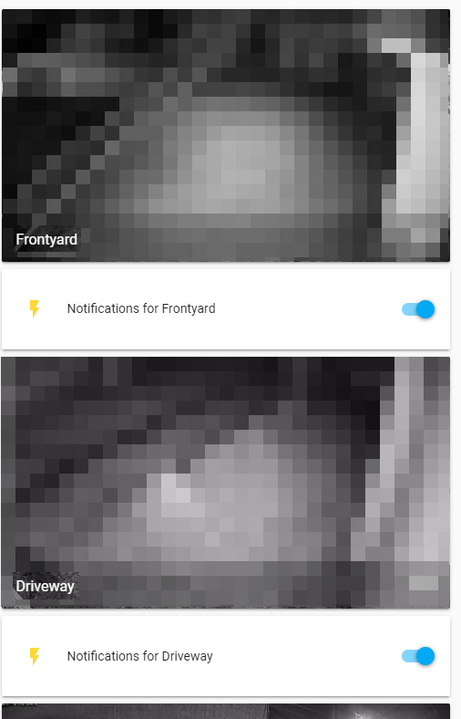
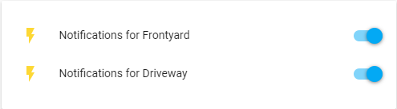

# zoneminder-notifier

Extendable zoneminder notifier that scans ZM's output directory for "alarm.jpg"s and sends notifications, if enabled for that camera. Made partially because ZM's background process filters weren't working reliably for me anymore, and partially so we could turn off notifications when doing yard work.

Whether or not a camera will send notifications can be changed on the fly (but isn't persisted) by POSTing to http://{IP}:3000/camera/{cameraId}.

## configuration
1. Create a config.yaml in this directory. Example config:
```
rootScanDirectory: D:\Zoneminder\

cameraDefinitions:
  - camera: Frontyard
    id: "5"
    notify: true
  - camera: Driveway
    id: "8"
    notify: true
  - camera: Patio
    id: "1"
    notify: true
  - camera: Backyard
    id: "7"
    notify: true
  - camera: West
    id: "6"
    notify: false

discordConfig:
  enabled: true
  webhookUrl: https://discordapp.com/api/webhooks/asdfjkl;
```

## notifiers
The only notifier right now is a discord webhook, but it should be easy to add new ones.

### discord
See [Intro to Webhooks](https://support.discord.com/hc/en-us/articles/228383668-Intro-to-Webhooks) for instructions on how to create the webhook URL needed for the config.

Set `enabled` to false to not use discord.

### adding new notifiers
1. Create a new class in `backend/src/notifiers` that implements `Notifier` and does whatever it needs to do with the path to the `alarm.jpg` passed in
2. Add the new class to `backend/src/notifiers/notifiers.module.ts`
3. Add the new class to `backend/src/notifiers/notifier.service.ts`

## home-assistant integration
To add buttons to toggle notification status in home assistant...

1. add restful switches to configuration.yaml
    ```
    switch:
      - platform: rest
        name: Notifications for Frontyard
        resource: http://192.168.1.153:3000/camera/5
        body_on: '{"notify": true}'
        body_off: '{"notify": false}'
        headers:
          Content-Type: application/json
        is_on_template: '{{ value_json.notify }}'
      - platform: rest
        name: Notifications for Driveway
        resource: http://192.168.1.153:3000/camera/8
        body_on: '{"notify": true}'
        body_off: '{"notify": false}'
        headers:
          Content-Type: application/json
        is_on_template: '{{ value_json.notify }}'
    ```
2. add switches to ui:
    * using vertical-stack card layout, under each video:
    ```
    cards:
    - camera_view: live
        entity: camera.frontyard
        type: picture-entity
    - entities:
        - switch.notifications_for_frontyard
        type: entities
    - camera_view: live
        entity: camera.driveway
        type: picture-entity
    - entities:
        - switch.notifications_for_driveway
        type: entities
    type: vertical-stack
    ```
    
    * using entity list:
    ```
    type: entities
    entities:
      - entity: switch.notifications_for_frontyard
      - entity: switch.notifications_for_driveway
    ```
    